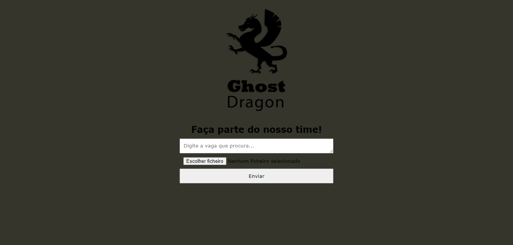
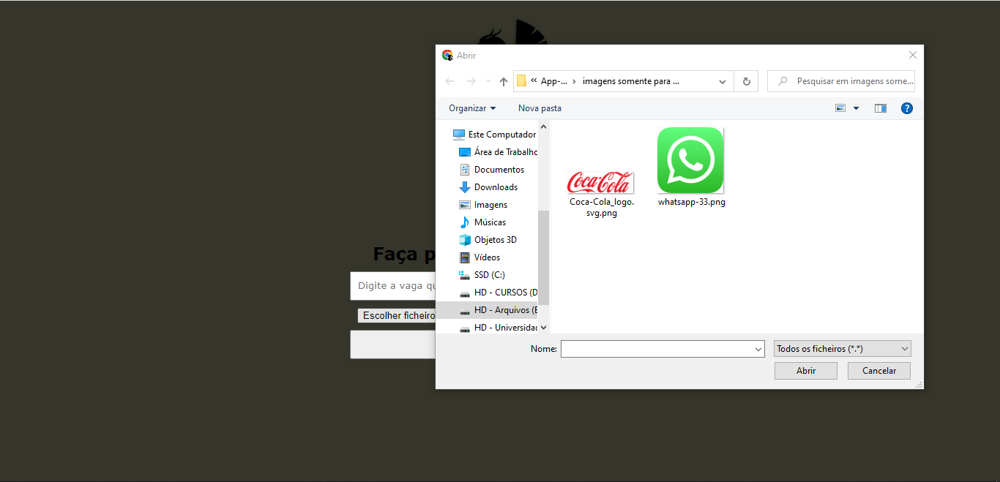
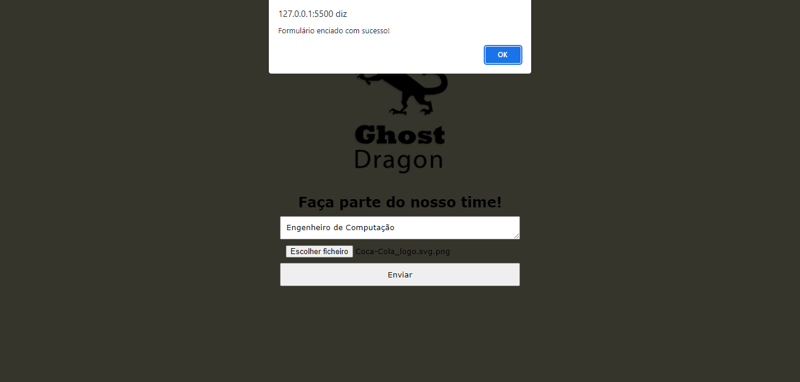
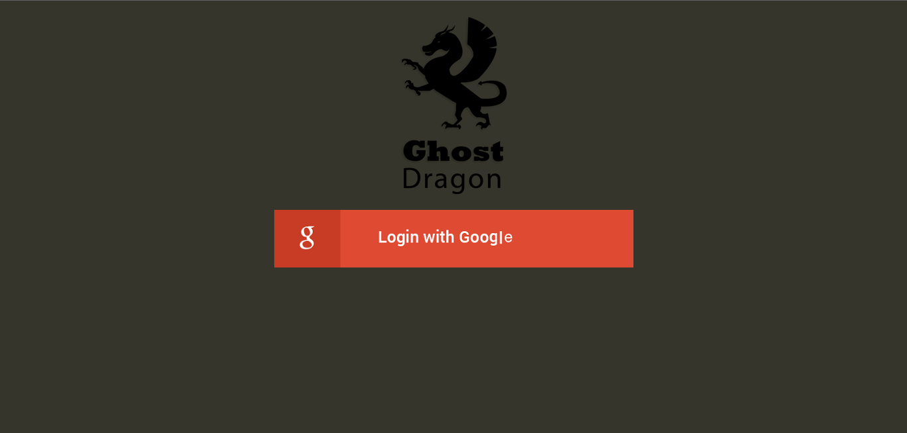
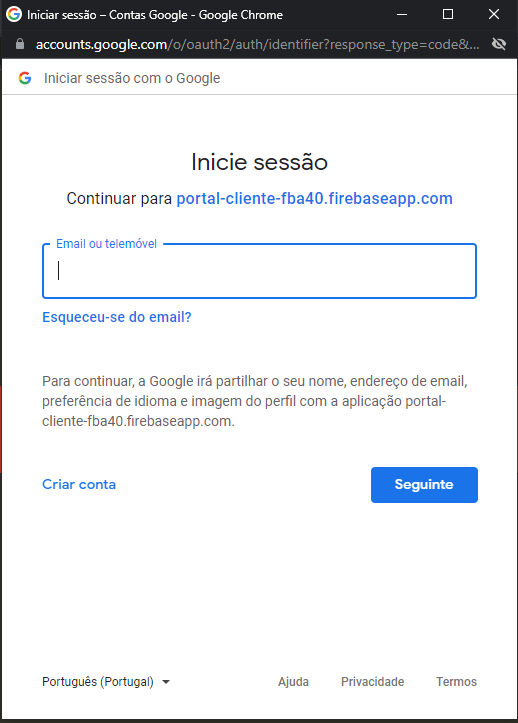
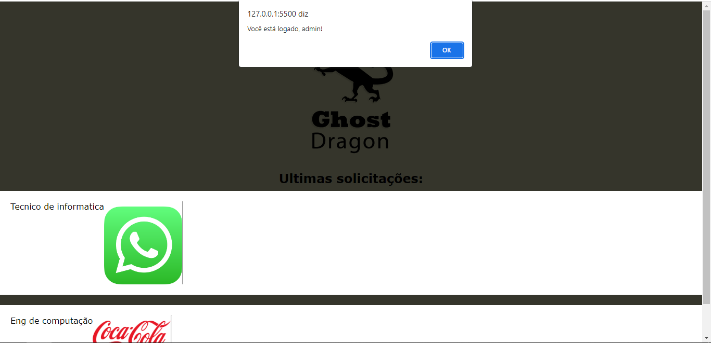
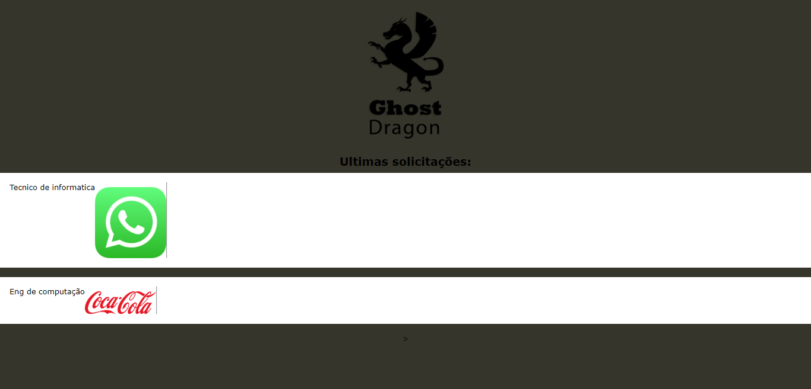
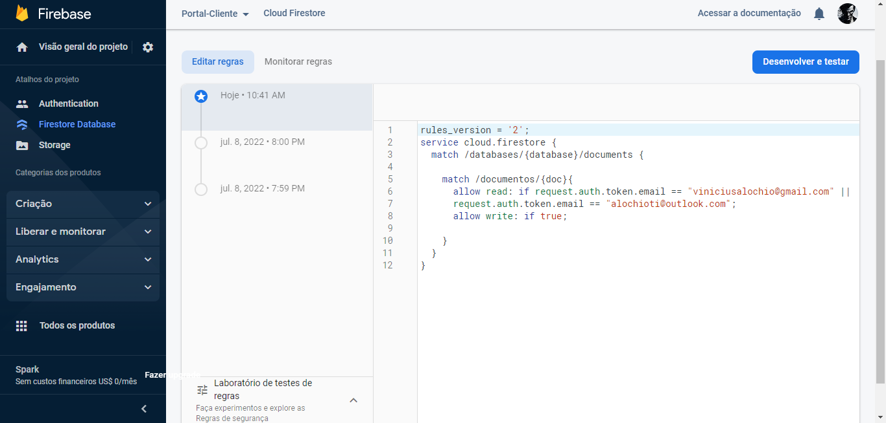
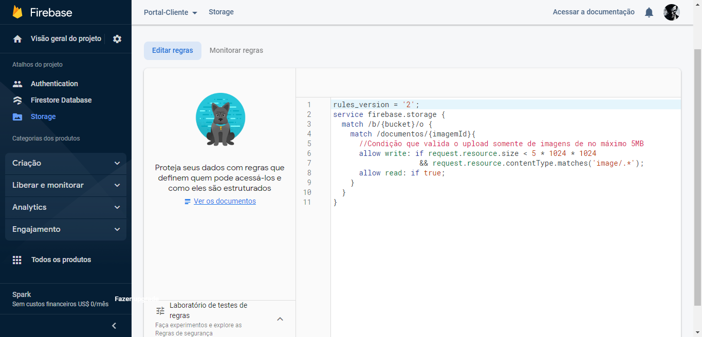

# Portal do Cliente - Sistema de Gestão com Firebase

Portal do cliente é um Web App responsivo, criado com o poderoso Firebase, onde este projeto foi um projeto proposto pela Danki Code no curso de Firebase.
O intuito projeto é a criação de um sistema, onde o usuário vai poder realizar um cadastro, enviando um cargo que deseja trabalhar e uma imagem de no máximo 5MB, onde a ideia seria a inserção de um currículo. Além dessa área de usuário, o sistemas também conta com uma área administrativa, onde o admin pode analisar em tempo real, todos os cadastros realizados.

Para o desenvolvimento do app, utilizamos as seguintes tecnologias:

### Área do Usuário:

	 
   
   

 

### Área do Admin:

	 
   
   
   

 

### Regras de segurança (para poder acessar as informações de admin, somente os emails cadastrados):

	 

 

### Regras de segurança (para o usuário conseguir upar somente arquivos do tipo imagem e que possuem um tamanho de até 5MB):

	 

 
